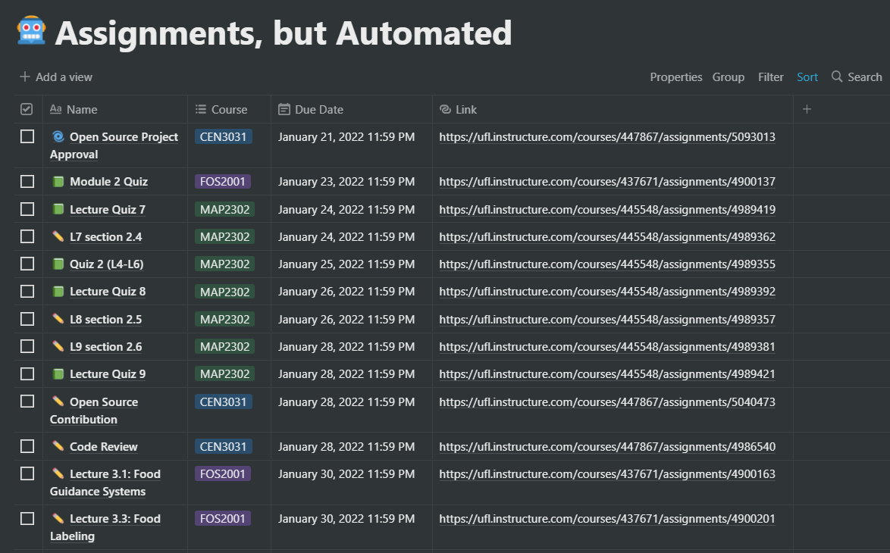
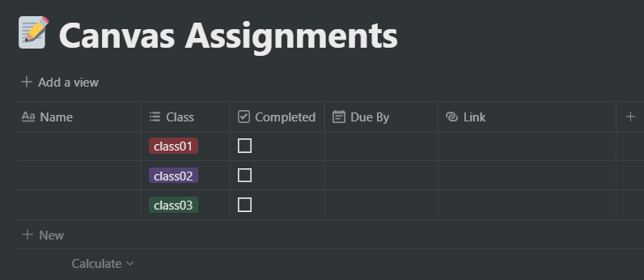
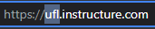
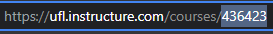
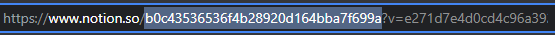

# Assignments, but Automated
An automated way of grabbing Canvas assignments and posting them to a Notion database



## 🔮 How it Works
1. When the script starts, every `checked` assignment will be removed
2. Afterward, the first `100` assignments from each specified course are uploaded to the database
   - Items that do not have due dates will not be listed in the database
   - Items whose due date already passed will not be listed
   - All due dates will be listed in the specified time zone in the `.env.` file
   - Names containing "Exam" are marked with 🅾️, "Project" with 🌀, and otherwise with ✏️ 
3. When a new semester starts, all you have to do is update the course tags in the database and change the courses' Canvas ids in the `.env`

## ⏰ Getting Started
### Cloning the Repository
Clone the repository with the following git command:
```
git clone https://github.com/RyanMcPherson7/assignments-but-automated.git
```
### Creating the Notion Database
1. This tutorial will assume you have working knowledge of making tables in Notion. If not, a tutorial can be found [here](https://www.keepproductive.com/blog/notion-tables)
2. Create a new Notion page and select `table` under `database`
3. Create a table with 4 columns, each for the name, date, course, and checkbox respectfully
   > Note: You can add any additional columns as you please
   1. Give the name column a `property type` of `Title`
   2. Give the date column a `property type` of `Date`
   3. Give the course column a `property type` of `Multi-select`
   4. Give the checkbox column a `property type` of `Checkbox`
      1. Create a new tag for each course you're taking
         > The tag names will be the 1st 7 characters of the course's name on Canvas. If the course name on Canvas is "COP3530 - DSA Fall 2021", then the tag name will be "COP3530"
4. You can sort the database by most recent date by clicking on `sort` in the upper right and select the date column's name with the property `Ascending`
5. If done correctly, your database should look something like this:



### Configuring the Environment File
1. The `.env` file holds all necessary variables for the script to run properly
2. The next few sections will show you how to aquire each variable's value 
3. For now, open the included `.env` file and have it off to the side 
4. The variable's name and corresponding value is as follows: 

| Variable Name | Value |
| ------------- | ----- |
|CANVAS_ORGANIZATION_TITLE|your organization's version of Instructure|
|CANVAS_API_KEY|your API key genearted for your Canvas account|
|COURSE_ID_LIST|list of canvas course ID's, each seperated by a comma|
|NOTION_API_KEY|your API key genearted for your Notion account|
|NOTION_DATABASE_ID|your database's specific ID|
|NOTION_CHECKBOX_ID|the exact name of your checkbox column|
|NOTION_NAME_ID|the exact name of your title column|
|NOTION_DATE_ID|the exact name of your date column|
|NOTION_MULTI_ID|the exact name of your course column|
|CANVAS_SEARCH_TYPE|the type of resource you wish to grab from Canvas|
|CANVAS_SEARCH_NUMBER_LIMIT|the number of resrouce items to grab from Canvas per course|
|CANVAS_COURSE_NAME_LENGTH|the length of each course tag's name in Notion|
|TIME_ZONE|the time zone in which all Notion dates will be in|

#### Canvas Variables
1. The orgainzation title can be found by logging in to your Canvas account and inspecting the URL. The hightlighted portion is the value of `CANVAS_ORGANIZATION_TITLE` in the `.env` file


2. The Canvas API key can be generated by logging on to your Canvas and clicking Account -> Settings -> scroll down to "Approved Integrations" -> click on "New Access Token" -> Generate Token. The token is the long string of characters under the "Token" section. This is the value of `CANVAS_API_KEY` in the `.env` file

3. The course Id's can be found by visiting each course's homepage and inspecting the URL. The highlighted portion is the class's Canvas course Id. Do this for every class and write out each value sperated by a comma in `COURSE_ID_LIST` in the `.env` file



#### Notion Variables
1. The Notion API key can be generated by going [here](https://www.notion.so/my-integrations) and clicking on "Create new integration" -> Submit. The API key is the Internal Integration Token under the "Secrets" header. Click on "Show" and copy this value into `NOTION_API_KEY` in the `.env` file

2. We now must connect your created integration to your database. On your Notion database page, in the upper right, click on Share -> Invite -> under "select an integration" choose the name of the integration you created to generate your API key -> Invite 

3. The Notion database Id can be found by inspecting the URL of your Notion database. For this step, you will have to use Notion's web browser version. The hightlighted portion is your database's Id (the portion after "notion.so/" and before the "?"). This is the value of `NOTION_DATABASE_ID` in the `.env` file


4. The naem of your checkbox column is the value of `NOTION_CHECKBOX_ID` in the `.env` file

5. The name of your title column is the value of `NOTION_NAME_ID` in the `.env` file

6. The name of your date column is the value of `NOTION_DATE_ID` in the `.env` file

7. The name of your multi-select (course) column is the value of `NOTION_MULTI_ID` in the `.env` file
   > Note: if you change the names of any of these columns, you must update them in the `.env` file

After completion, your `.env` file should look something like this:
```
CANVAS_ORGANIZATION_TITLE = ufl
CANVAS_API_KEY = XXXX~XXXXXXXXXXXXXXXXXXXXXXXXXXXXXXXXXXX
COURSE_ID_LIST = 436423,123456,654321

NOTION_API_KEY = secret_XXXXXXXXXXXXXXXXXXXXXXXXXX
NOTION_DATABASE_ID = b0c43536536f4b28920d164bba7f699a
NOTION_CHECKBOX_ID = Course
NOTION_NAME_ID = Name
NOTION_DATE_ID = Due By
NOTION_MULTI_ID = Class
```

## 🚀 Running the Script
1. We will be running the script uisng Node.js. You can download it [here](https://nodejs.org/en/download/)
2. To install the Node moduals, navigate to the project folder `assignments-but-automated` and run the following command (you only have to do this once):
```
npm install
```
3. To run the script, run the command:
```
npm start
```
> This will take a few seconds depending on your internet connection and number of assignments
