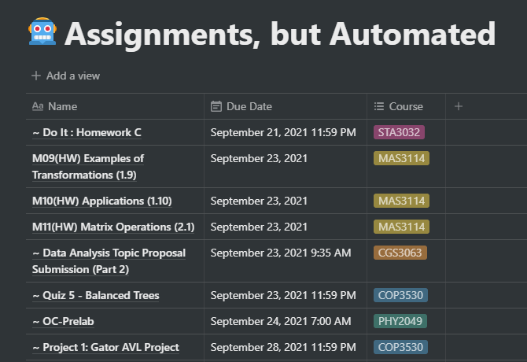

# Assignments, but Automated
An automated way of grabbing Canvas assignments and posting them to a Notion database



## :cyclone: Getting Started
### Cloning Repository
Begin by cloning the repositry. A tutorial can be found [here](https://docs.github.com/en/repositories/creating-and-managing-repositories/cloning-a-repository)
### Creating the Notion Database
1. This tutorial will assume you have working knowledge of making tables in Notion. If not, a tutorial can be found [here](https://www.keepproductive.com/blog/notion-tables)
2. Create a new Notion page and select "table" under "database"
3. Create a table with 3 columns, each for the name, date, and course, respectfully
   1. Give the name column a property type of "title"
   2. Give the date column a property type of "date"
   3. Give the course column a property type of "multi-select"
      1. Create a new tag for each course you're taking
         > The tag names will be the 1st 7 characters of the course's name on Canvas. If the course name on Canvas is "COP3530 - DSA Fall 2021", then the tag name will be                    "COP3530"
4. If done correctly, your database should look something like this


### Configuring Environment File
The `.env` file holds all necessary variables for the script to run properly
#### Canvas Variables
#### Notion Variables


## :rocket: Running the Script
1. We will be running the script uisng Node.js. You can download it [here](https://nodejs.org/en/download/)
2. Navigate to the folder containing the script.js file and run the command:
```
node script.js
```
- This will take a few seconds depending on your internet connect and number of assignments
     > You must be connected to the internet

## :crystal_ball: Additional Features
